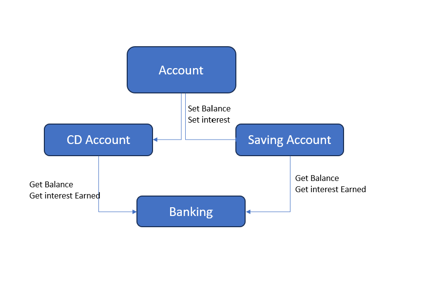

# customer_banking

## Summery
customer banking system that allows users to calculate and track interest earned on savings and CD accounts. By running this application, users will be able to enter their savings and CD account information, see the interest earned, and view the updated balances after a specified number of months.

## Intereset Earn Calculation

Interest on the balance is calculated as follows: 

```sh
interest = balance * (apr/100 * months/12).
```

## Flow Daigram 
The files consist of the following files: Accounts.py, savings_account.py, cd_account.py, and customer_banking.py. The Accounts.py file contains the Account class with methods to set the balance and interest.

In the savings_account.py file, imported the Account class and create a create_savings_account function that will create a savings account instance, calculate the interest earned based on user input, update the account balance with the earned interest, and return the updated balance and interest earned.

In the cd_account.py file, imported the Account class and create a create_cd_account function that will create a CD account instance, calculate the interest earned based on user input, update the account balance with the earned interest, and return the updated balance and interest earned.

In the customer_banking.py file, imported the create_savings_account and create_cd_account functions, then create a main function that prompts the user to enter the savings and CD account details, call the corresponding functions to calculate the interest earned and update the balances, and display the results.

